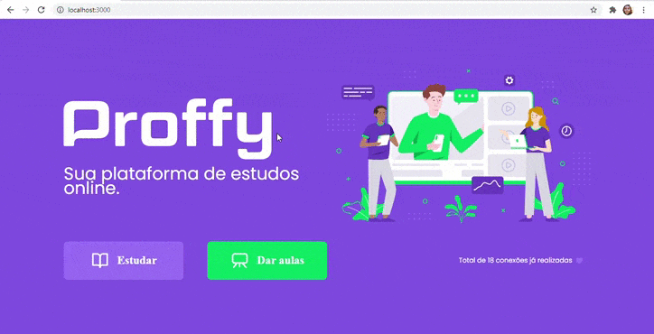

<h1 align="center">
	Next Level Week 2.0 Rocketseat
</h1>

<h2 align="center"> 
	 Proffy
</h2>

<p align="center">
 <a href="#-sobre-o-projeto">Sobre</a> •
 <a href="#-layout">Layout</a> • 
 <a href="#-como-executar-o-projeto">Como executar</a> 
</p>


## 💻 Sobre o projeto

Minha implementaçao do conteúdo da Next Level Week 2.0 da Rocketseat.

Proffy é uma plataforma para conectar professores e alunos.

---


## 🎨 Layout

###  Web

<p align="center">
	
</p>

---

## 🚀 Como executar o projeto

Este projeto é divido em três partes:
1. Backend (pasta server) 
2. Frontend (pasta web)
3. Mobile (pasta mobile)

💡Tanto o Frontend quanto o Mobile precisam que o Backend esteja sendo executado para funcionar.

### Pré-requisitos

Antes de começar, você vai precisar ter instalado em sua máquina as seguintes ferramentas:
[Git](https://git-scm.com), [Node.js](https://nodejs.org/en/). 
Além disto é bom ter um editor para trabalhar com o código como [VSCode](https://code.visualstudio.com/)
 
 #### Para baixar o projeto
 ```bash
# Clone este repositório
$ git clone https://github.com/JuDCraide/Next-Level-Week-2.0-Rocketseat

# Acesse a pasta do projeto no terminal/cmd
$ cd ./Next-Level-Week-2.0-Rocketseat
```

#### Rodando o Backend (servidor)

```bash

# Vá para a pasta server
$ cd server

# Instale as dependências
$ yarn install

# Execute a aplicação em modo de desenvolvimento
$ yarn start

# O servidor inciará na porta:3333 - acesse http://localhost:3333 

```


#### Rodando a aplicação web (Frontend)

```bash

# Vá para a pasta da aplicação Front End
$ cd web

# Instale as dependências
$ yarn install

# Execute a aplicação
$ yarn start

# A aplicação será aberta na porta:3000 - acesse http://localhost:3000

```
#### Rodando a aplicação mobile 
```bash

# Vá para a pasta da aplicação Front End
$ cd mobile

# Instale as dependências
$ yarn install

# Execute a aplicação
$ yarn start

# A aplicação será aberta na porta:3000 - acesse http://localhost:3000

```

---

<h4 align="center">
  Feito com ❤️ por Júlia D. Craide 👋️ Entre em contato!
</h4>